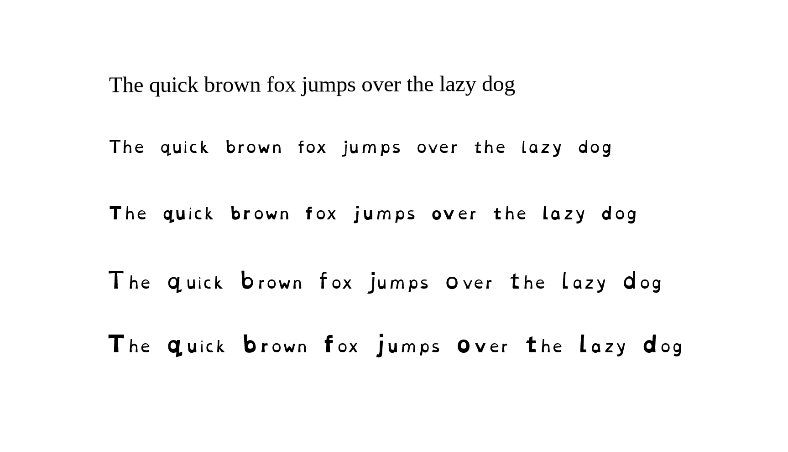
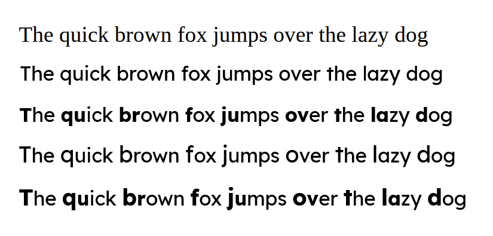

    
  
  
  
  
  
  A free, PWA PDF accessibility tool for people with reading disabilities. The project is based in React + Vite, using Zustand for state storing, and PDF.js for PDF processing. 

 

---

## ⭐ Getting Started

1. **Open** the [website](https://threecatswink.github.io/Dyslexia-PDF-Reader/)
2. **Press** the **folder button**
3. **Select** the **PDF** you wish to view
4. **Press** the **menu button**
5. **Set** your **preferred readability settings**
6. **Enjoy** easier reading

---

## 🔍 Demo
Shown **below** is an **example** of the **different settings** that can be applied to the text. Going from original text, to text overlay, to half bold, to accent, to half bold and accent

  
  Example with OpenDyslexic Font

    

  
  Example with Lexend Font

---
## ✨Features
Despite the AI looking sparkle emoji, **no AI** is involved in this project. Here is a list of features for you.
- **Standard PDF Viewability** - Has all of the features to browse a PDF, with accessibility in mind.
- **UI Feedback** - All interactive elements have feedback when you use them/can't use them.
- **ARIA** - Structured to optimize ARIA compliance for all users.
- **Multiple Fonts** - Lets the user select between Standard, OpenDyslexic, and Lexend.
- **Half Bold** - Bolds the first half of each word.
- **Accent Letter** - Increases the font size of the first letter in a word.
- **Ruler** - Adds a focus on where your cursor is pointing.
- **Text-to-Speech** - Allows you to use the in-built TTS in your browser.
- **Advanced Settings** - Lets you to tweak various settings to your liking.
- **Saved Settings** - PWA allows your user preferences to be saved on your device so everything stays how you like.

---

## 📜 Principle

My philosophy/principles as a solo developer is that accessibility tools should be **easily available** to **all people** for **free**.
- PWA **saves your user settings locally** on your device. 
- There is **no telemetry or tracking** software used.
- Your PDF's are **processed on device**.
- **Nothing is uploaded** to a **third-party**.
- All open-source and transparent.
- **No ads**.
- **No logins**.
- **No free trials**.

---

## 🗝️ Access Keys

> [!NOTE]
> Combinations of CTRL, ALT, SHIFT, etc. will depend on what browser you are using.

| Keybind    | Description                                                  |
| :--------- | :----------------------------------------------------------- |
| Access + l | Toggle the outline sidebar                                   |
| Access + o | Requests a PDF file input                                    |
| Access + [ | Presses the _previous page_ button                           |
| Access + p | Lets you enter a _page number_ to travel to in your document |
| Access + ] | Presses the _next page_ button                               |
| Access + r | Toggles Text-To-Speech                                       |
| Access + - | Presses the _zoom out_ button                                |
| Access + = | Presses the _zoom in_ button                                 |
| Access + r | Toggles Text-to-Speech                                       |
| Access + s | Presses the _viewer settings_ button                         |

---
